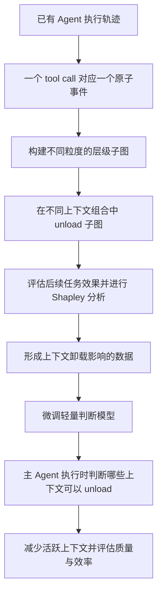
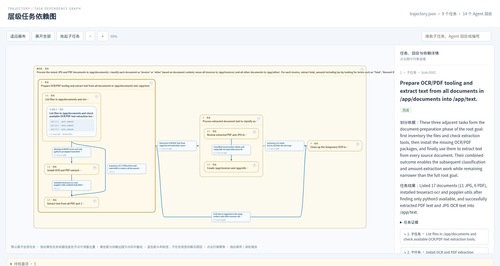

# 基于层级轨迹图与 Shapley 分析的 Agent 上下文管理

本文介绍项目目标、技术路线与当前进展。更新日期：2026-09-30。

## 项目目标

本项目分析 Agent 已有的执行轨迹，将轨迹组织成不同粒度的层级子图，并研究：**在不同的上下文组合下，unload 某个子图对应的上下文，是否会损害后续任务的效果？**

Agent 在长任务中会不断积累工具调用、执行结果和中间信息。其中一部分仍然影响后续决策，另一部分已经完成作用，或被新的结果替代。项目希望通过 Shapley 分析获得上下文卸载影响的数据，再用这些数据微调一个轻量模型。在主 Agent 执行任务时，由轻量模型判断哪些上下文可以 unload，减少主 Agent 需要处理的历史信息，并检验是否能够降低开销、改善任务表现。

这里的 `unload` 指将相应内容移出主 Agent 后续可见的上下文，已经执行的操作及其对环境产生的效果保持不变。

## 整体技术路线

现阶段已有轨迹建图与可视化基础；Shapley 卸载分析、数据构建、轻量模型训练和在线管理效果仍需后续实验验证。

## 一、将执行轨迹建成不同粒度的层级图

**一个 tool call 直接作为一个原子事件。** 原始调用参数、返回结果和来源 ID 随调用保留，直接用于构图。

层级表示同一条轨迹在不同粒度下的组织方式。细粒度下，两个 tool call 就可能共同构成一个子任务、对应一个小子图；继续向上组合，若干子图可以组成更大的子任务；最粗粒度下，整条轨迹构成一个完整的大图。

| 粒度 | 图中的内容 | 可分析的对象 |
| --- | --- | --- |
| 原子粒度 | 单个 tool call 及其返回结果 | 一次调用对应的上下文 |
| 较细粒度 | 例如两个 tool call 组成的子任务 | 一个小子图对应的上下文 |
| 中间粒度 | 多个调用或子任务组成的更大子图 | 一个阶段或较大子任务对应的上下文 |
| 最粗粒度 | 整条执行轨迹 | 完整轨迹图 |

子图内部和子图之间的依赖关系，记录前序调用产生的信息如何被后续执行使用。这样既可以查看一个局部子任务的细节，也可以从更粗粒度观察整个执行过程。

不同粒度的子图都可以成为 Shapley 分析的元素。一次分析需要明确选用的粒度与组合，避免将同一段上下文通过父子子图重复计算。在线决策时只能使用当时已经发生的轨迹；完整轨迹图用于展示全部执行过程。

## 二、通过 Shapley 分析评估 unload 的影响

分析的核心操作是：**在一种上下文组合下，比较 unload 某个子图前后的后续任务效果，并在不同组合中重复这一比较。**

具体过程如下：

1. 选择一个执行时点，固定当时的环境状态和用户任务要求。
2. 选择某个粒度下的一组子图，构造不同的上下文组合。
3. 对包含目标子图的组合，分别保留和 unload 该子图的上下文，从相同环境状态继续执行。
4. 比较两种条件下的后续任务完成情况或结果质量。
5. 按 Shapley 的权重汇总不同组合中的卸载影响，或通过采样近似计算。

如果 unload 某个子图经常使后续任务效果下降，说明它在这些状态和组合下仍然提供重要信息；如果影响较小，则可以作为卸载候选。不同子图可能相互补充或替代，因此批量卸载还需要检查组合效果。

例如，一组安装工具的调用对前期执行很重要。安装成功并确认工具可用后，后续任务可能已经不需要完整安装日志。需要评价的是这些日志在当前时点被 unload 后的影响，而该安装操作已经产生的环境变化继续保留。

同一子图的卸载影响可能随任务阶段变化，因此数据应同时记录执行时点、当前上下文组合、目标子图和后续效果。已有轨迹用于构图与选择分析位置；真实卸载影响需要通过可恢复环境中的续跑和任务验证器测量。

## 三、利用分析数据训练轻量模型

将子图、当前任务状态、上下文组合和对应的卸载影响组织成训练数据，微调一个轻量模型。

主 Agent 执行任务时，轻量模型根据当时可见的信息判断哪些上下文可以 unload。被选中的内容移出后续请求，主 Agent 继续执行。最终需要同时评估任务成功率、累计 token、端到端时间，以及轻量模型自身带来的开销。

这条路线将离线轨迹分析与在线上下文管理连接起来：通过离线受控实验获得监督信号，再让轻量模型在实际执行过程中完成较低成本的判断。

## 已有图示与当前进展

下面展示根目录 [trajectory.json](trajectory.json) 对应的已有图页面截图，可以观察任务的展开关系和子图之间的信息依赖。

图中展示文档分类与金额提取任务：整条轨迹构成外层大图，内部展开为 OCR 准备、文档分类与提取、清理临时文件等子图，蓝色箭头表示任务间的信息依赖。点击图片可查看原尺寸。

截图来自本地已有页面 `trajectory-graph/runs/frontier-test/tree.html`，已核对其记录的源文件哈希与根目录 `trajectory.json` 一致。该旧版页面包含 9 个任务、14 个 Agent 回合，蓝色回合框可能包含多个 tool call；本项目当前采用的原子粒度为单个 tool call。截图用于展示已有层级图的组织与交互形式。

当前已有轨迹读取、层级任务归并、信息依赖构建、结构化结果输出和网页展示等实现。语义边类型发现模块也已有原型，可辅助研究子图之间关系的表达。Shapley 卸载实验与在线管理效果尚待验证。

相关实现说明：[轨迹建图](trajectory-graph/README.md)、[边类型发现](https://github.com/ZPRRR2004/llm_Iterative_Edge_Type/blob/main/src/build_edges/README.md)。

本地补充材料：`RESEARCH_REVIEW.md` 记录待审核的论文调研与备选方案，`TODO.md` 记录待办事项。
