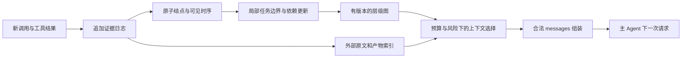

# 在线层级建图与上下文卸载：研究调研与方案评审

调研日期：2026-09-30。**状态：待审核。** 本文的新观点、备选方案和实验建议尚未确认采用，审核事项已列入 [TODO](TODO.md)。项目整体介绍见 [PROJECT_OVERVIEW.md](PROJECT_OVERVIEW.md)。

依据包括当前本地源码、论文正文和官方项目资料。本次没有运行正式实验。下文将“已有实现”“文献结论”“本文提案”分别说明；论文报告的效果不能直接视为本项目可复现的效果。

## 1. 核心判断

项目的原子单元是一个 tool call，直接使用原始调用及返回信息构图。层级表示不同粒度的子图：细到两个 tool call 组成的子任务，粗到完整轨迹图。Shapley 分析关注在不同上下文组合下，unload 某个子图是否损害后续任务效果。

**动态建图在工程上可行。** 当前实现中的调用与结果处理、前序信息来源选择具有增量化基础。主要改造在于持续接收事件、保持任务边界可修订、控制构图开销，以及把图上的选择落实到下一次实际模型请求中。

**“用贡献标签微调小模型，再让它监控卸载”可以作为实现路线，但单独作为研究贡献较弱。** 现有工作已经覆盖小型压缩器蒸馏、子任务折叠、可恢复的上下文管理，甚至在线依赖图驱动的卸载。下面的相关工作表给出直接重合点。

建议优先验证这个问题：

> 在仅能看到当前轨迹前缀的条件下，层级任务结构、信息依赖和可恢复性，能否帮助系统以更低的总成本保留足够支持后续执行的信息？

这里需要三个互相支撑的部分：可修订的在线图、明确的上下文干预与价值定义、真实续跑中的质量和成本评价。小模型可用于降低控制开销，是否采用应放在这些问题验证之后。

## 2. 相关工作与重合范围

以下只使用原论文、会议页面、作者项目或官方方法文档。优先核验与方案最接近的工作，未对整个领域做穷尽检索，因此不作首创性判断。

### 2.1 上下文管理与动态图

| 工作与原始来源 | 已经研究的内容 | 对本项目的影响 |
| --- | --- | --- |
| [MEM1: Learning to Synergize Memory and Reasoning for Efficient Long-Horizon Agents](https://arxiv.org/html/2506.15841v2)，2025 | 用 RL 学习将旧状态与新观察整合为紧凑状态，移除此前原始历史 | 上下文管理作为策略学习已有先例；需要检验显式结构带来的额外价值 |
| [ACON: Optimizing Context Compression for Long-horizon LLM Agents](https://arxiv.org/html/2510.00615v3)，2025 / 2026 修订 | 根据完整上下文成功、压缩后失败的对照优化压缩规则，并将压缩器蒸馏到较小模型 | 与轻量模型辅助主 Agent 的路线高度重合；可比较结构化反事实标签与普通压缩监督 |
| [Scaling Long-Horizon LLM Agent via Context-Folding](https://arxiv.org/abs/2510.11967)，2025；[官方项目](https://context-folding.github.io/) | 使用 `branch/return` 执行子任务并返回摘要，通过 FoldGRPO 学习折叠行为 | 子任务执行与上下文折叠已结合；本项目要检验从轨迹恢复的跨任务关系是否有用 |
| [AgentFold: Long-Horizon Web Agents with Proactive Context Management](https://arxiv.org/html/2510.24699v1)，2025 | 对历史连续区间进行细粒度压缩或多步合并，用 SFT 学习多尺度折叠 | 层级/多尺度摘要已有直接先例；交错任务和共享产物适合检验图选择与区间折叠的差异 |
| [Active Context Compression: Autonomous Memory Management in LLM Agents（Focus）](https://arxiv.org/html/2601.07190v1)，2026 | 主动更新持久 Knowledge 块，再清除历史；可通过工具和提示词实现 | 适合无需训练的简单基线；论文只评估 5 个 SWE-bench Lite 样例，证据规模有限 |
| [ACM: Agentic Context Management for Long Horizon Tasks](https://arxiv.org/html/2607.23809v1)，2026 | 主动压缩，原文落盘，按需查询，并通过后训练改进管理行为 | 卸载与恢复本身已有；保留原文只保证可取回，不保证 Agent 会正确触发恢复 |
| [LCM: Lossless Context Management](https://papers.voltropy.com/LCM)，2026，作者论文 | 不可变历史存储、层级摘要 DAG、预算触发压缩和原文定位 | 分层摘要加原文指针已有系统设计；摘要 DAG 与执行任务依赖图的语义不同 |
| [Beyond Compaction: Structured Context Eviction for Long-Horizon Agents（CWL）](https://arxiv.org/html/2606.11213v1)，2026 | Agent 在线标注 episode 及依赖，程序按预算和依赖执行渐进卸载 | **最直接的图管理基线。** 不能把“在线建图后卸载”整体当作新增想法 |
| [Self-GC: Self-Governing Context for Long-Horizon LLM Agents](https://arxiv.org/html/2607.00692v1)，2026 | 将上下文组织成有索引的对象，侧路规划器提出 fold/mask/prune，执行层管理恢复和缓存相关提交 | 外部控制器、对象生命周期和可恢复修改已有；需要比较决策依据和闭环效果 |
| [When Can Agents Forget Their Reasoning? ICLR for Long-Horizon Agent Context Compression](https://arxiv.org/html/2609.29875v1)，2026-09-24 预印本 | 用冻结代理模型对可见 reasoning 块评分并在线移除，保留动作与观察；分析状态外化后历史推理的作用 | 强调信息价值随状态变化、局部删除会改变后续执行。文中 ICLR 是方法缩写，此链接不能作为会议接收证据 |
| [Zep: A Temporal Knowledge Graph Architecture for Agent Memory](https://arxiv.org/html/2501.13956v1) 与 [A-MEM: Agentic Memory for LLM Agents](https://arxiv.org/html/2502.12110v1)，2025 | 分别研究时序知识图更新，以及记忆的动态链接与演化 | 支持增量图组织的可行性，但对象主要是记忆事实与关联，不能替代任务执行依赖的验证 |

CWL 尤其需要仔细对照。其实际协议只表达 exploration → action 依赖，未支持 action → action 和 exploration → exploration。我们现有的原子信息来源、递归任务结构和更丰富关系类型提供了可比较的扩展空间；这些扩展是否值得成本，需要通过实验判断。该论文也说明其评估属于初步结果。[CWL §4.3、§6–7](https://arxiv.org/html/2606.11213v1)

### 2.2 归因、Shapley 与层级分析

| 工作与原始来源 | 可借鉴的方法 | 与本项目的区别 |
| --- | --- | --- |
| [ContextCite: Attributing Model Generation to Context](https://proceedings.neurips.cc/paper_files/paper/2024/file/adbea136219b64db96a9941e4249a857-Paper-Conference.pdf)，NeurIPS 2024 | 随机消融上下文来源，用稀疏代理模型解释目标生成，也评估按归因剪枝后重新回答 | 已涉及归因驱动剪枝；评估未来 Agent 任务回报仍需单独定义 |
| [TokenShapley: Token Level Context Attribution with Shapley Value](https://aclanthology.org/2025.findings-acl.200/)，ACL Findings 2025 | 基于隐藏表示与 weighted KNN 代理计算 token 级贡献 | 其精确计算针对 KNN 博弈，不能直接称为真实 Agent 回报的精确归因 |
| [Data Shapley: Equitable Valuation of Data for Machine Learning](https://proceedings.mlr.press/v97/ghorbani19c.html)，ICML 2019 | 明确 players、价值函数与采样估计 | 原对象是训练数据；迁移到上下文时必须重定义干预和效用 |
| [Shapley Context Pruning: A Cooperative Game Perspective for Context Reranking and Pruning（SCP）](https://arxiv.org/html/2607.16209v1)，2026 | Deep Sets 价值网络、句子级 Shapley、Top-K 剪枝；附录也讨论层级上下文 | **Shapley 加上下文剪枝已有直接重合。** 主要实验是 RAG/QA，附录层级方案属于概念讨论 |
| [Dual-Grained Agent Memory and Shapley Context Attribution for Multimodal Agentic Learner（DG-Mem）](https://arxiv.org/html/2608.23268v1)，2026 | 离线评估检索规则集合的贡献，用于调整记忆检索 | 测试时冻结记忆；对象是规则集合，未实现长任务中的动态轨迹卸载 |
| [Long-Horizon Agent Trajectory Attribution: A Unified Benchmark and Fine-Grained Annotation Framework](https://arxiv.org/html/2608.06909v1)，2026 | 轨迹组件归因、来源定位、归因链恢复及 leave-one-out 基线 | 主要评估已出现行为的解释，不能直接当作卸载的未来回报标签 |
| [SHAP PartitionExplainer 官方文档](https://shap.readthedocs.io/en/latest/generated/shap.PartitionExplainer.html)，访问于 2026-09-30 | 在特征层级上递归分配贡献，得到 recursive Owen values | 层级归因已有成熟定义；需说明树结构、masker 和价值函数如何对应任务图 |

SCP 的价值网络主要使用支持句与干扰句的排序监督，不能直接等同于 Agent 真实续跑回报。将其思路迁移到本项目时，应单独检验代理价值与任务回报之间的关系。[SCP §3.2、Appendix A](https://arxiv.org/html/2607.16209v1)

来源核验说明：CWL、SCP 的 arXiv 页面显示的提交日期与编号月份存在不一致，因此本文只标年份，保留精确链接；LCM 使用作者提供的论文。本文未采用二手页面中的冲突作者信息或额外性能数字。后续用于正式投稿时，应再次核对版本、BibTeX 和发表状态。

## 3. 当前代码能否改成在线建图

### 3.1 可以复用的部分

本节按当前代码核验可复用部件，改造目标遵循单 tool call 原子粒度。现有程序仍含逐结点 annotation 阶段，2.0 适配器仍采用 agent event 粒度；这些是实现与当前项目定义之间需要对齐的差异。

| 当前代码 | 已有能力 | 在线化方式 |
| --- | --- | --- |
| [4.0 normalize.py](trajectory-graph/src/trajectory_graph/adapters/terminal_bench_4_0/normalize.py) | 保留单个 tool call、返回结果与来源 ID | 调用结果到达后直接更新原子事件，供构图与下一次上下文选择使用 |
| [dependencies.py](trajectory-graph/src/trajectory_graph/dependencies.py) | 每个目标从更早事件中选择信息来源 | 只计算新结点的入边，复用旧证据 |
| [grouping.py](trajectory-graph/src/trajectory_graph/grouping.py) | 连续前缀归并、局部窗口和有限边界复核 | 只更新活动区域及受影响祖先，保留稳定子树 |
| [4.0 dependencies.py](trajectory-graph/src/trajectory_graph/adapters/terminal_bench_4_0/dependencies.py) | 排除同一 source step 内调用的相互依赖 | 进一步使用工具结果实际可见的先后关系处理实时并行 |
| [rzp execution_manager.py](rzp/src/build_edges/execution_manager.py) | 逐窗口发现、比较、复核类型并提交 | 类型学习放在较慢更新通道，在线控制固定一个版本 |

在线控制时点应明确为“已经收到本轮结果、尚未发出下一次模型请求”。当前依赖卡片包含目标调用的结果，可以在此时使用；不能把该结果拿去模拟调用发生前的卸载判断。

### 3.2 必须改变的批处理假设

**第一，去掉未来信息。** `rzp` 在 [split/main.py](rzp/src/split/main.py) 中直接为 `future_events` 生成 `future_summary`。在线输入只允许使用已到达信息。离线全轨迹图可以作为事后分析或 oracle 对照；控制器训练输入必须按前缀重新生成。

**第二，允许尾部任务保持未完成。** 现有 `need_more_context` 用来扩展已经加载的窗口；到达文件尾部后会要求作出决定。在线系统需要 `defer/open`，等待新的结果。右侧边界参考只能来自当前时刻已经到达的事件，允许有限确认延迟。

**第三，稳定身份与展示编号分离。** [validate.py](trajectory-graph/src/trajectory_graph/validate.py) 的 `stable_ids()` 按当前树遍历重新编号，不能保证不同图版本中的同一任务维持 ID。在线需要 `task_uid + revision`，合并、拆分保存前后映射，显示序号可以重新排列。

**第四，支持追加输入和异步结果。** 当前 CLI 检查整份输入文件哈希，`rzp` 恢复要求完整 manifest 不变。实时系统需要追加日志和消费游标。4.0 当前规范化还要求同一步中调用与结果数量、顺序匹配；在线应按 `source_call_id` 绑定 pending、乱序和迟到结果。

**第五，任务重开要保持结构合法。** 当前归并要求连续片段。已闭合任务后来出现修复工作时，可以新增一个执行片段并链接先前任务，保留历史结构；把不连续片段直接合成一个树结点，需要另行扩展表示和校验。

### 3.3 建议的在线架构：三层状态



证据层追加保存原始日志；解释层维护可修订的任务、边和摘要；请求层决定模型实际看见哪些内容。**卸载作用于请求层，证据层继续保留。** 仅隐藏可视化结点，或只在图中添加 `unloaded=true`，不会减少模型输入。

本文研究应用层消息与内容的选择。GPU KV-cache 的逐 token 淘汰属于另一层机制；实际部署还需测量消息重组引起的缓存失效和重新计算成本。

建议原型接口如下，属于待实现设计：

```python
ingest(event) -> EventDelta
update_graph(prefix_cursor, delta) -> GraphRevision
select_context(graph_revision, active_task, budget) -> ContextPlan
materialize(context_plan) -> Messages
reload(node_uid, detail_level) -> Evidence
```

首版可以只支持 `full / summary / pointer` 三种表示。`materialize` 处理顺序、去重、工具调用与返回的合法配对、来源引用和 token 预算。协议元信息保留不意味着必须保留整段工具输出；应按实际 Agent/API 的消息契约构造合法替换。

控制开销也需要设计：新事件先进行轻量登记；只在阶段切换、异常、验证完成或预算临近时触发较贵的边界复核。语义依赖候选可以通过产物引用和检索缩小，但共享路径只说明候选关联，不能直接判定信息依赖。新增原子证据后，只重投影受影响的任务边。

语义模型可能漏掉依赖。原型应将不确定块暂时保留，允许后续恢复。声称所有“未被当前图引用”的历史都可删除，会把构图缺漏误当成无用信息。

## 4. Shapley 分析应如何定义

### 4.1 先固定干预对象

项目需要测量的是“从当前状态继续执行时，这些信息是否仍需可见”。历史动作的效果已经进入环境；卸载上下文时保留这些效果。

在时刻 $t$ 定义：

- $z_t$：固定的环境检查点，例如文件、必要进程状态和工具会话状态；
- $A_t$：始终保留的用户要求、必要约束和协议信息；
- $N_t=\{1,\ldots,n\}$：候选单元索引，$B_i$ 为对应的上下文内容；
- $C_t(S)=\operatorname{render}(A_t,\{B_i:i\in S\})$：实际送入主 Agent 的上下文；
- $\pi$：固定的主模型、工具配置和后续控制规则。

定义组合价值：

$$
v_t(S)=\mathbb{E}_{\xi}\left[R\left(\operatorname{Rollout}(\pi,z_t,C_t(S);\xi)\right)\right].
$$

$R$ 优先采用任务验证器给出的结果；随机性 $\xi$ 包括采样等因素。后续上下文管理规则必须对各组合一致。若允许重新检索被移出的内容，就明确评估“可恢复卸载”策略，并计入恢复成本；若禁止恢复，则是在测即时可见信息的作用。两种设置应分开报告。

从同一检查点删除一段日志，与删除产生该日志的历史操作后重新执行，回答不同问题。后者会改变环境状态，不能混作上下文管理标签。

### 4.2 层级图如何成为 players

每次选择树上的一个不相交切面：其中的任务子图覆盖本次待分析的 tool call，父任务及其后代不会同时作为独立 player。分析粒度可以从两个 tool call 组成的小子图逐步扩大到完整轨迹图；在线时可选范围限定为已经发生的轨迹前缀。可以先分析粗任务，再细分重要或不确定区域。

设 $T$ 为 unload 前保留的子图组合，且 $i\in T$。对目标子图 $i$，比较 $T$ 与 $T\setminus\{i\}$ 下的后续效果。按移除操作写出的 Shapley 值为：

$$
\phi_{i,t}=\sum_{\substack{T\subseteq N_t\\i\in T}}
\frac{(|T|-1)!(n-|T|)!}{n!}
\left[v_t(T)-v_t(T\setminus\{i\})\right].
$$

这与标准 Shapley 定义等价，表达的是不同上下文组合中的加权卸载损失。正值表示平均而言 unload 该子图会降低后续效果，负值表示这些比较中卸载后效果反而更好。由于 $A_t$ 固定保留，$v_t(\varnothing)$ 通常不为零。贡献总和对应 $v_t(N_t)-v_t(\varnothing)$。贡献值随执行时点、候选集合、渲染方法和后续策略变化，不能当作永久标签。

不同层级分别计算的值属于不同博弈，不能直接相加。若采用层级 coalition 约束，可使用 recursive Owen value 的定义，并明确层级约束带来的归因含义。[PartitionExplainer](https://shap.readthedocs.io/en/latest/generated/shap.PartitionExplainer.html)

树提供分析分组；跨任务依赖需要额外处理。可以比较三种方案：固定必要边界事实、将强耦合事件合成分析块，或定义依赖闭包 $C_t(S)=\operatorname{render}(A_t,\operatorname{closure}(S))$。闭包方案计算的是“选择单元并补齐其依赖”的价值，其语义与独立删除不同，也可能导致许多组合得到相同输入。

### 4.3 贡献分数与批量卸载决策要分开

Shapley 汇总不同组合中移除一个子图的影响。实际一次卸载多个子图时，还需要评估该集合的联合影响。两个互相替代的证据块可能各自可以删，两个都删却使任务失败。

对候选卸载集合 $D$，应另外测量联合损失：

$$
\Delta_t(D)=v_t(N_t)-v_t(N_t\setminus D).
$$

因此首版至少比较：Shapley 排序、leave-one-out 排序、结构规则，以及对候选集合做联合消融的选择。用额外采样得到损失区间有助于决策，但有限样本区间和归因公理均不能自动提供无损卸载保证。

还要区分卸载与摘要。`原文→空缺`、`原文→摘要`、`原文→可检索指针` 是三种不同干预，不能混用同一个分数解释。首版可固定一种渲染方式评估，再逐步扩展为多动作选择。

### 4.4 成本与数据可信度

精确 Shapley 要评估指数级组合。建议先在少量块上枚举或进行排列采样，粗层级筛选后只细化有必要的部分。同一检查点与相同渲染输入可以复用已记录的评估，但随机回报仍需要重复样本；“没有评估”不能填成零贡献。

下一步动作概率、固定目标回答概率或冻结小模型分数可以作为便宜代理。应在一部分真实续跑上校准其排序和损失预测，分别报告代理误差、采样误差与构图误差。静态 JSON 可以支持图构建和代理归因；没有可恢复环境时，不应宣称得到真实任务成功率的干预贡献。

## 5. 比“直接微调监控模型”更值得优先验证的方向

以下均为本文提案。相关组成部分已有文献基础，贡献应通过机制差异和实验结果建立。

### 5.1 优先方向：保留跨任务边界信息，卸载子图内部过程

完成一个子任务后，后续任务通常只需要它的一部分结果。可以为子图维护一份结构化边界记录：输出事实、产物及版本、仍有效的约束、未解决问题、关键失败教训、必要证据引用和恢复入口。

例如“安装依赖并验证可用”完成后，可以保留包版本、验证结果和环境标识，卸载大段下载日志；如果后续出现兼容性错误，则恢复相关安装与验证记录。环境发生变化后，原来的“可用”结论需要重新检查，单纯保留文件路径不足以保证信息仍有效。

这里值得研究的是：**图上的哪些跨边界信息足以支持下游任务，怎样发现摘要漏掉了必要约束？** 可以利用依赖边产生待保留事实，再用续跑发现失效案例，比较普通自然语言摘要、结构化边界记录、边界记录加恢复三种方法。

依赖约束卸载已有 CWL，可恢复层级摘要已有 LCM；我们需要额外证明层级任务边界和显式证据要求能够改善保留质量。[CWL](https://arxiv.org/html/2606.11213v1)、[LCM](https://papers.voltropy.com/LCM)

这个方向可以先用规则和现有模型完成，训练小模型放在成本优化阶段。首版不把边界记录称为“最小充分状态”，除非给出对应的理论条件或充分的经验验证。

### 5.2 将上下文价值建模为随状态变化，并纳入恢复代价

一次失败的命令在修复前可能很重要，修复验证通过后可能只需保留失败原因。反过来，一个已卸载的配置说明在任务切换后可能重新变得重要。因此，控制目标应包含“现在是否需要”和“未来取回有多困难”。

建议对同一子图在多个检查点分别评价：保留原文、仅保留边界记录、卸载后允许检索。记录后续任务质量、实际重新访问、重做操作以及检索延迟，形成状态相关的管理数据。

可以先用简单模型估计动作收益，或直接使用结构和成本规则。若采用学习，输入使用当前活动任务、已观察到的证据、产物状态和预算；标签来自受控续跑。未来结果可以构成标签，未来摘要和终态图不能进入当时的特征。

状态外化后推理价值变化已有直接研究，恢复机制也有 ACM 等先例。扩展点在于将这一问题落实到任务子图及跨任务关系上，并测量恢复的净收益。[When Can Agents Forget Their Reasoning?](https://arxiv.org/html/2609.29875v1)、[ACM](https://arxiv.org/html/2607.23809v1)

### 5.3 在预算下共同选择“保留哪些块、以什么粒度保留”

层级图带来的一个实用能力是混合粒度：正在进行的任务保留调用级细节，已完成但相关的任务保留边界摘要，较远的任务只保留检索入口。

可将决策定义为树切面和表示级别的联合选择。每段历史由一个选定层级覆盖，避免父摘要与全部子记录重复计费；跨分支依赖通过必要边界信息承接。目标是在质量容差内减少总成本，或在固定预算下最大化任务表现。

原型可以比较逐块贪心、树上选择和带依赖约束的选择。Shapley 可用于产生候选和识别交互，但不能假设所有块的真实收益可加，因此简单背包求解只优化一个近似目标。最后仍要检验联合选择的续跑结果。

这一方向尤其适合测试任务交错、远距离引用和共享中间产物。AgentFold 已有多尺度区间折叠，SCP 也讨论层级上下文；新增证据应回答依赖约束与自适应粒度能否带来更好的质量—成本曲线。[AgentFold](https://arxiv.org/html/2510.24699v1)、[SCP](https://arxiv.org/html/2607.16209v1)

### 5.4 将可复核的上下文干预数据与评测协议作为独立产物

比单个分类器更有复用价值的成果，是带执行检查点和干预记录的数据：同一状态下，保留、摘要、卸载和恢复某组上下文分别导致什么结果。

每条样本至少记录任务与环境版本、前缀游标、图版本、干预范围、实际 messages 哈希、恢复权限、随机种子、续跑轨迹、验证器结果和成本。对无法完整恢复的进程或远端状态标记限制，不把文本重放冒充环境重放。

这样的数据可以用于研究图粒度、贡献估计、卸载策略和模型泛化。已有轨迹归因工作可提供组件定义参考；本项目若补上任务奖励下的可重复干预，需要与该类解释型数据明确比较。[Long-Horizon Agent Trajectory Attribution](https://arxiv.org/html/2608.06909v1)

### 5.5 `rzp` 的边类型如何服务这些研究

类型库可以帮助表达不同的信息保留义务。例如 `USES_PREVIOUS_RESULT_AS_INPUT` 提示保留被消费的结果，验证关系提示区分“产物存在”和“产物已通过检查”，修复关系提示保留必要故障证据。

首先需要新增具体事件对的类型与证据标注。类型定义丰富不代表控制有效；建议做“无类型依赖图 / 少量固定类型 / 数据发现的类型”三组对照，检验复杂类型库是否改善卸载决策。

训练集上发现和修订类型，测试时固定类型库版本，可减少评测泄漏。如果允许测试会话内演化，需要严格限定到当前前缀，并将这一设置独立报告。低频类型和不确定关系可保留 `unknown`，不能强行归类后直接触发卸载。

### 5.6 建议的优先级

| 方向 | 近期作用 | 关键验收点 |
| --- | --- | --- |
| 检查点与上下文干预评测 | 为所有后续主张提供可信依据 | 同一状态可重复续跑，干预确实改变模型可见内容 |
| 在线局部图与边界记录 | 直接复用现有结构工作 | 前缀构图无未来信息，保留必要证据的成本可控 |
| 联合选择与按需恢复 | 检验结构是否改善管理质量 | 同预算优于无图/无恢复基线，恢复成本计入总账 |
| 近似 Shapley 与状态价值 | 检验复杂监督是否有收益 | 相比 leave-one-out 和简单规则，排序或闭环收益更好 |
| 微调小模型或训练策略 | 降低有效方法的部署成本 | 在明确控制任务上，以更低开销保持策略效果 |

## 6. 怎样做实验才能回答研究问题

### 6.1 将图质量与控制效果分开

先逐前缀构图，检查任务边界、原子覆盖和依赖证据。保留一小批人工复核的前缀；完整轨迹图只作为事后参照，不能当作无误真值。报告边界修订频率、依赖误差、每次更新延迟和模型调用成本。

随后固定主 Agent、环境和预算，在真实续跑中比较管理策略。即使离线图看起来合理，控制收益仍可能被错误卸载、额外构图请求或重复搜索抵消。

### 6.2 先建立可恢复的小规模样本

首轮可选择少量有自动验证器、容器或环境可恢复的任务，每个任务取几个有明确阶段变化的检查点。候选图块保持较少，先能完成重复续跑和联合消融，再扩大规模。

现有 Terminal-Bench 轨迹适合选择候选任务，但必须另外确认任务源码、环境镜像、验证器和中途状态是否可获得。若只能从任务初始环境重放，须检查重放到目标时点后的状态一致性；网络服务、时间、随机数和长期进程都会影响一致性。完全不可恢复的样本只进入代理分析。

### 6.3 必须控制的因素

| 因素 | 实验要求 |
| --- | --- |
| 未来泄漏 | $G_t=F(\tau_{\le t})$；摘要、类型特征和任务边界只使用当时可见信息 |
| 数据划分 | 按任务及相近任务族分组；同一任务的多个检查点不能跨训练、验证、测试集 |
| 主模型与工具 | 固定主模型版本、任务指令和环境工具权限；允许各方法必要的管理接口说明，披露新增提示长度与调用成本；只在训练/验证划分调优 |
| 隐式完整历史 | 独立构造请求和会话，避免服务端状态或隐藏记忆继续提供被卸载内容；使用缓存时验证其实际前缀 |
| 派生信息 | 图标签、摘要、边界记录和控制器状态都记录来源；严格删除组移除相关信息的派生表示，摘要组按替代表示评价；禁止恢复组不得从存档重新注入 |
| 环境一致性 | 每次从独立复制的同一快照开始；干预前核验状态，避免上次续跑污染下次 |
| 随机性 | 使用配对运行设置；允许时固定种子，并进行多次重复。种子相同也不保证远端服务完全确定 |
| 恢复权限 | 原文存储对各方法一致；是否可检索、检索方式和预算需要明确 |
| 消息合法性 | 工具调用与结果引用、必需用户指令和协议结构保持合法 |
| 成本口径 | 主模型、构图、控制器、摘要、检索、重试均计入在线成本；离线归因成本另报 |

归因实验与部署实验使用不同预算口径并分别报告。归因实验可固定后续工具步数和输出上限，以比较信息可见性的作用；部署实验固定总 token 或费用，允许较短上下文换取更多执行资源。后一设置下的贡献同时包含信息与资源收益，不能混作前一设置的标签。

### 6.4 基线与消融

优先使用同一主模型下的可控基线：完整历史、最近窗口、固定预算摘要、简单工具输出遮蔽、摘要加检索、按任务完成状态折叠、CWL 式依赖卸载、Shapley 排序卸载，以及本文的边界记录加联合选择。

测试检查点若使用真实反事实续跑计算 Shapley 排序，应单列为 oracle/昂贵规划参考，因为它额外访问环境分支和验证器。可部署方法使用训练集得到的估计器，或将测试时全部分支评估纳入成本；不能把测试分支成本移入离线标注后，与在线规则或小模型直接比较。

完整历史超过模型上限时，报告其可运行范围；不要静默加入压缩后仍称为完整历史。ACON、ACM 等可在代码和环境适配后加入；若只复现其核心机制，应标为该机制的实现，不能使用论文同名暗示完全复现。AgentFold、MEM1 等涉及主模型训练，需与固定主模型的管理模块对照分开解释。

核心消融包括：

1. 平面事件块与层级任务块，隔离分组粒度的作用。
2. 无图、只有任务树、树加无类型依赖、树加类型依赖，隔离各结构组件。
3. 普通摘要与结构化边界记录，使用相同 token 预算。
4. 无恢复与可恢复卸载，分开报告恢复触发和实际成功。
5. leave-one-out、Shapley、联合消融；比较相同标注预算下的效果。
6. 在线前缀图与离线全知图；后者只作 oracle 参考，不计入可部署主结果。
7. 规则控制与小模型控制；在相同输入和动作空间下比较。

建议专门加入易暴露问题的任务：重复证据被同时移除、很早出现的关键约束、修复后再次失败、多个任务共享产物、任务关闭后重开，以及文件已改变导致旧摘要失效。这些样本用于解释机制，不应全部成为针对本方法定制的唯一测试集。

### 6.5 指标

主要报告任务成功率或验证器得分，以及完成整项任务的累计成本和端到端时间。同时报告峰值活跃上下文、主模型与管理模块各自的 token/延迟、恢复次数、恢复成功率、额外工具调用和重复工作。

使用质量—成本曲线、固定预算下任务质量、相近质量下成本三种视角。给任务级配对差异和不确定区间；避免仅按单步节省 token 判断收益，也避免将同一任务的多个检查点当成完全独立样本。

## 7. 建议的推进顺序与论文表述

**第一步：验证干预评测。** 先确认能够从相同状态续跑，并验证真正修改了模型输入。检查保留原文、移除一块和移除多块的差异，建立噪声水平。

**第二步：实现最小在线图。** 直接使用单次 tool call 与返回结果，复用历史依赖和有限边界复核，补齐 open/defer、持久 ID、图版本及追加输入。先不追求完整在线类型演化。

**第三步：做无需训练的结构化控制。** 用已闭合任务的边界记录替换细节，保留恢复入口，在同预算下对照普通摘要和图依赖卸载。

**第四步：检验价值信号。** 只有当图结构表现出收益或明确的失败规律后，再比较 Shapley 与更便宜的近似，收集适合学习的标签。保留/移除标签不足以监督摘要内容或恢复时机，后两者需要独立动作评价。

**第五步：优化控制成本与泛化。** 训练轻量模型或其他策略，检验跨任务、跨主模型、跨上下文预算的泛化，并报告离线标注成本的摊销。

适合向老师提出的研究主张是：

> 我们希望研究层级执行结构能否成为上下文管理的有效单元：在任务进行中，利用已观察到的信息依赖构建局部图，选择需要保留的跨任务信息，并通过可恢复卸载减少活跃上下文。通过固定执行检查点的反事实续跑，评估不同子图和管理动作的状态相关价值，验证其对任务质量和整体成本的影响。

潜在成果包括前缀图构建与管理方法、可复核的干预数据与协议，以及结构/价值/恢复机制的实证比较。是否形成方法层面的创新，需要完成与 CWL、SCP、ACON 等直接相关工作的对照；当前最值得先投入的是可信评测与一个无需训练的闭环原型。
